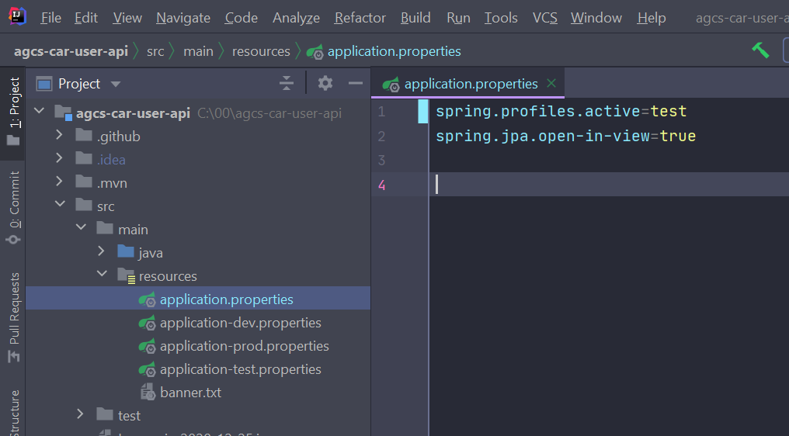
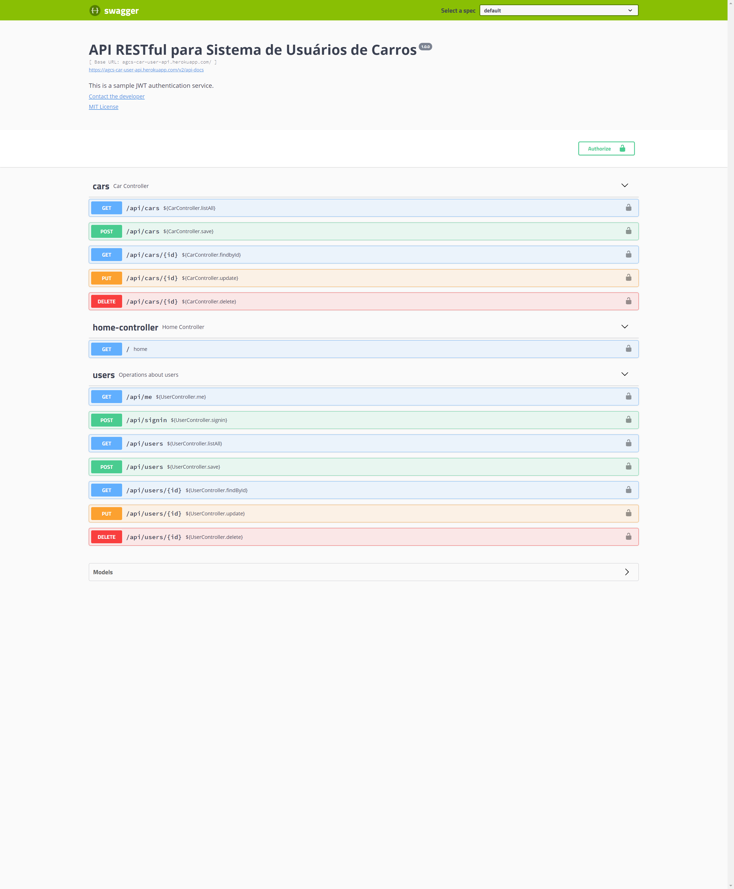

# AGCS Car User API
&nbsp;


***


&nbsp;

## API RESTful para Sistema de Usuários de Carros.

&nbsp;
&nbsp;

## How to use this code?
&nbsp;

1. Make sure you have [Java 11](https://www.java.com/download/) and [Maven](https://maven.apache.org) installed


2. Clone this repository
  
```
$ git clone https://github.com/arllain/agcs-car-user-api
```

3. Navigate into the folder  

```
$ cd agcs-car-user-api
```

4. Install dependencies

```
$ mvn install
```

5. Run the project

```
you need to change to test profile in the application.properties file
 
```
<p align="left">
  
</p>


```
$ mvn spring-boot:run
```

6. Navigate to `http://localhost:8080/swagger-ui.html` in your browser to check everything is working correctly. 


***
&nbsp;

## You can access the api in Heroku at: [agcs-user-api](https://agcs-car-user-api.herokuapp.com/swagger-ui.html)

&nbsp;

<p align="left">
  
</p>

***
&nbsp;

***
&nbsp;

## You can see all the user stories in this [kanban board](https://github.com/arllain/agcs-car-user-api/projects/1)

&nbsp;

<p align="left">
  
</p>

***
&nbsp;


---

Made with 💜 by Arllain 👋 [See my linkedin](https://www.linkedin.com/in/arllain/)
